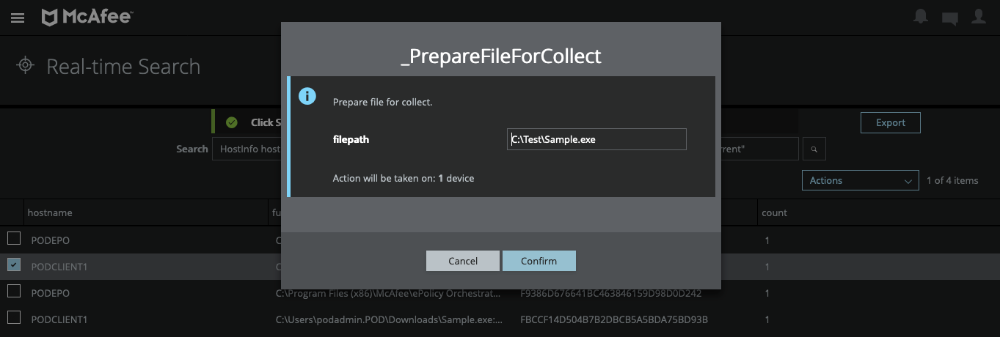
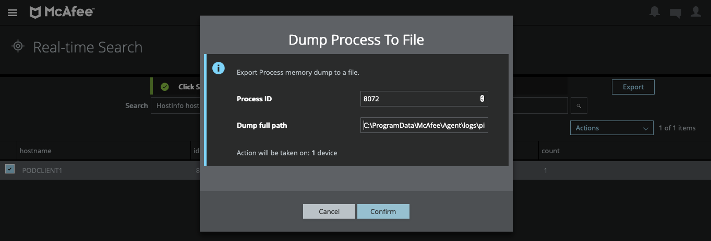
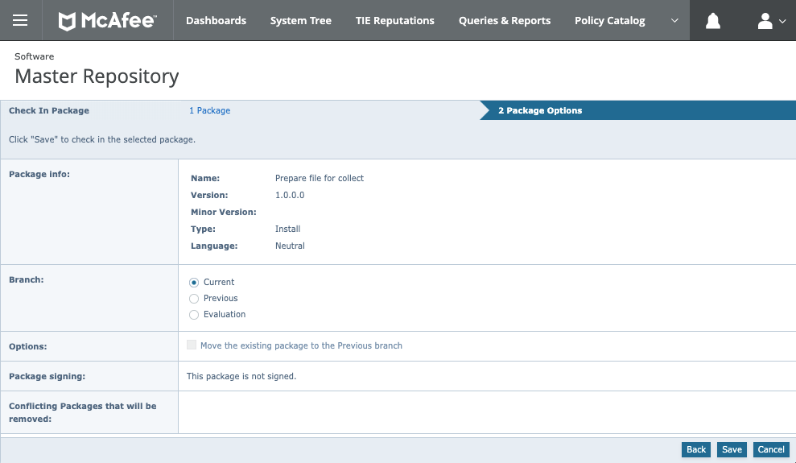
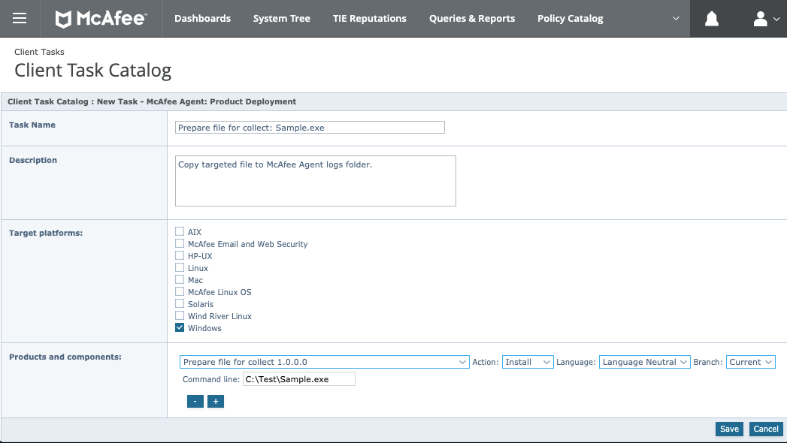
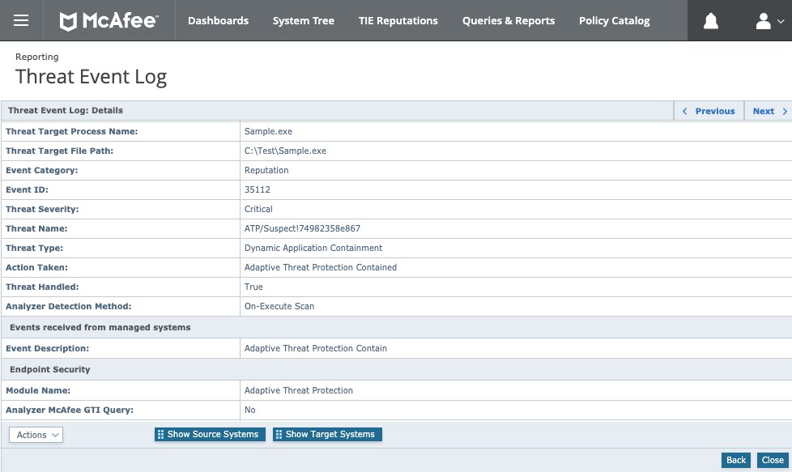
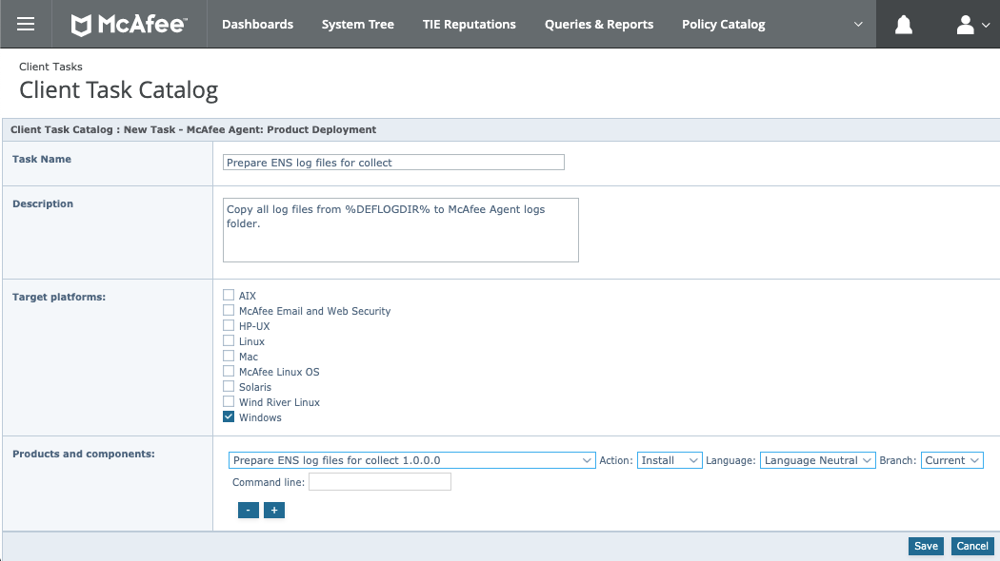
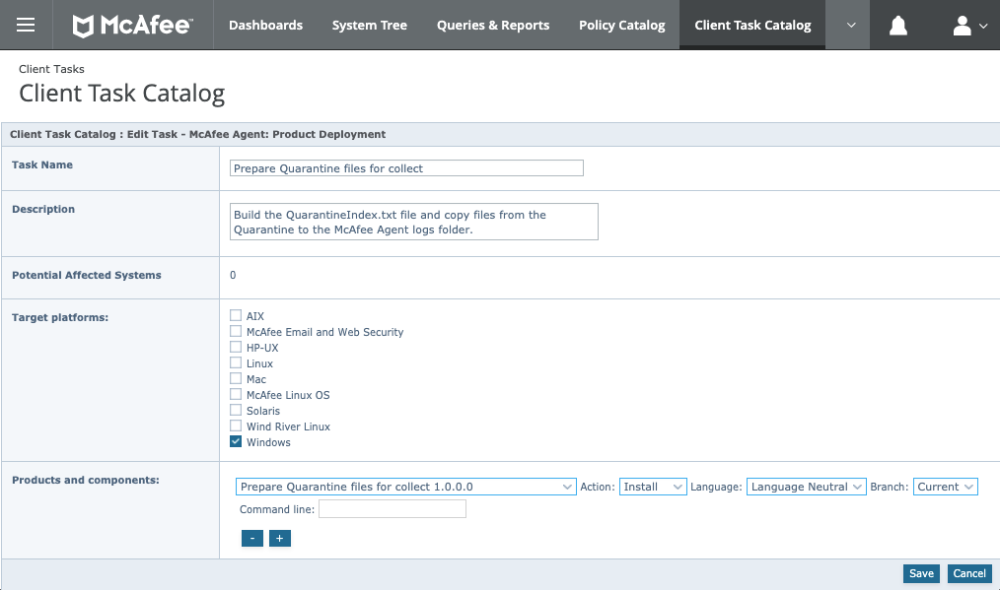
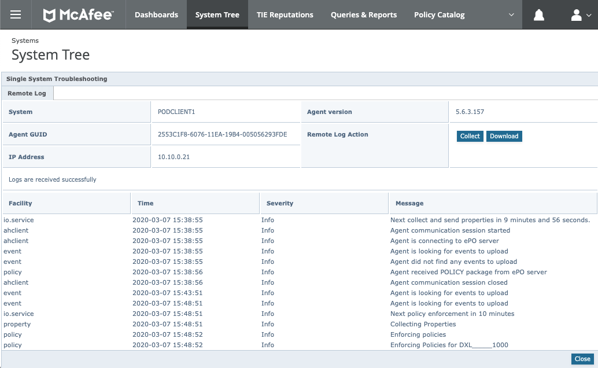
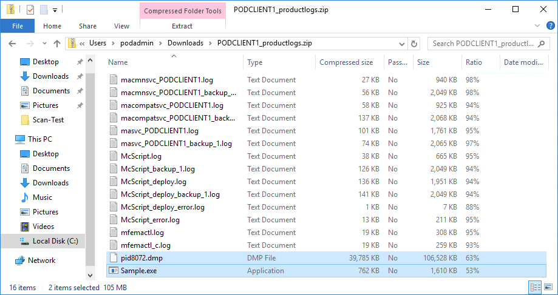
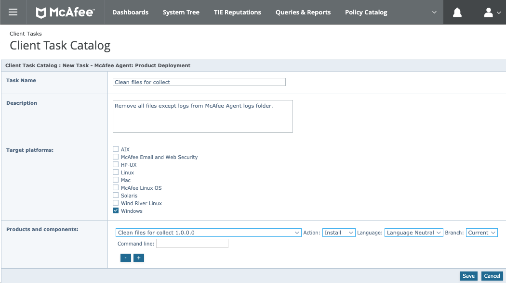

# Collecting Files from Endpoints via McAfee ePolicy Orchestrator

## Requirements

### Products Versions
This procedure will work only if the minimum version listed bellow for each components are respected:
- ePO Version: 5.9.1 (ePO On-Premise or Hosted on AWS/Azure only)
- McAfee Agent Version: 5.6.X

### Permission Set
You will have to use the **Single System Troubleshooting** feature from ePO, so your user account must have enough rights to proceed. If this line stay greyed in the **System Tree** menu, ask your ePO Administrator for adapted **Permission Set**.<br>
If you are not familliar with collecting **McAfee Agent** log, please review the **Knowledge Center** article [KB91283](https://kc.mcafee.com/corporate/index?page=content&id=KB91283). Or review the McAfee Agent 5.6 documentation chapter [Viewing McAfee Agent logs](https://docs.mcafee.com/bundle/agent-5.6.x-product-guide/page/GUID-F2605AD0-BCFC-415A-8A56-212526CC4324.html).

### McAfee Agent Policy
The **General** settings of your McAfee Agent policy must be modified to permitted the following actions to write files in the McAfee Agent logs folder. To do this, please unselect the setting __Enable self protection (Windows Only)__ from the **General options** section. To enforce protection of the McAfee Agent files and registry we will have to implement a custom set of **Expert Rules** through Endpoint Security Exploit Prevention. (Please see Appendix A to implement a proposed set of rules.)

**Note:** _You may also want to set a lower value for the ASCI. As we need to revert back the McAfee Agent policy once the file is collected, an ASCI set to 5 or 10 minutes will be perfect._

## Workflow for collecting files
Here I would like to take time to share a recommanded workflow to proceed with the content shared. If you are interrested in collecting files from endpoints and you have prepared your ePO Client Task / MVISION EDR Reaction and McAfee Agent policy, please use the following workflow as a Best Practice:
1. Apply the McAfee Agent policy (with self-protection disabled) on your targeted endpoint.
2. Run the ePO Client Task / MVISION EDR Reaction to prepare the file(s) for collect.
3. Collect the files via the action Single System Troubleshooting.
4. Revert back the McAfee Agent policy to your default one.

## Preparing the file for collect

You can prepare the file for collect from **MVISION EDR** through a custom reaction or from **McAfee ePO** through a custom package. Feel free to use the most convenient for you.

### Preparing the file for collect from MVISION EDR

#### Custom Reaction Creation
You need first to create a custom reaction to run on a targeted system with the file path in parameter to prepare that file for collect.

From your MVISION EDR console, go to Menu -> Catalog -> Reaction -> and click Add. Define the custom reaction as follow:
- **Name:** _PrepareFileForCollect
- **Description:** Prepare the file for collect.
- **Windows Type:** Execute OS Command
- **Content:** Use the following script.
```bat
@ECHO OFF
SETLOCAL
SET FILEPATH={{filepath}}
SET MYKEY=HKLM\SOFTWARE\McAfee\Agent
FOR /F "skip=2 tokens=2*" %%A IN ('REG QUERY %MYKEY% /v "DataPath"') DO SET DATAPATH=%%B
COPY /Y "%FILEPATH%" "%DATAPATH%logs"
ENDLOCAL
EXIT /B %ERRORLEVEL%
```
- **Reaction Arguments:** Click Add.
- **Name:** filepath
- **Type:** String
- **Timeout:** You can let the Timeout to the default 60 sec value or adjust the value if you want to let more time for the local copy of the file.

Click Save to finish the creation of the custom reaction.

#### Use case A: Collect a file after a search
Let's say you did a search for a suspicious file with a **Real-time Search** query like this:
```
HostInfo hostname and Files full_name, md5 where Files name contains "Sample.exe" and Files status equals "current"
```
Select the system where you want to collect the file, copy the file path and click on Actions -> Custom -> _PrepareFileForCollect then paste the file path. Click OK to copy the file for collect. Repeat this action for each file you want to collect.



#### Use case B: Collect a process dump
Let's say you did a search for a suspicious running process with a **Real-time Search** query like this:
```
HostInfo hostname and Processes id, name where Processes name contains "notepad"
```
Select the system where you want to collect the file, copy the process id and click on Actions -> Investigation -> Dump Process To File, then paste the process id and type a file name prefixed with the following path:
```
C:\ProgramData\McAfee\Agent\logs\
```
i.e.: C:\ProgramData\McAfee\Agent\logs\pid8072.dmp. Click OK to dump the process to a file ready for collect.



**Note:** _If you want to follow the progression of your actions or review the one that have been taken previously, click Menu -> Action History._

### Preparing the file for collect from McAfee ePO

#### Custom Package Check In
You need a custom package to prepare the file for collect. I've design for you the package "Prepare file for collect" (COLLECTF1000.zip). This package take in parameter the full file path of the targeted file for collect.

To check in ePO this package from your ePO Console, click Menu -> Software -> Master Repository -> Check In Package. Browse your local file system to the file COLLECTF1000.zip and click Save.



#### Define the Deployment Client Task
Next, you need to define a **Client Task** to run a the targeted system. From your ePO Console, click Menu -> Client Tasks -> Client Task Catalog, select **McAfee Agent** in the left panel, then click the **New Task** button. Select a **Task Types** of "Product Deployment" and define the task with the following value as an example:
- **Task Name:** Prepare file for collect: Sample.exe
- **Description:** Copy targeted file to the McAfee Agent logs folder.
- **Target platforms:** Windows
- **Products and components:** Prepare file for collect 1.0.0.0
- **Command line:** The full file path of the targeted file, i.e: C:\Test\Sample.exe



Click **Save** to complete the Client Task creation.

#### Run Client Task Now
To run the package on the targeted system you can assign the Client Task on a Single System or choose to Run the Client Task now. To do so from the ePO Console, go to Menu -> System Tree, then use the filter or select the targeted Organisation Unit (OU) within your system tree to identify your targeted system.

Select the system, click Actions -> Agent -> Run Client Task Now, then from the **Product** left-panel select "McAfee Agent", select "Product Deployment" as **Task Type**, and select "Prepare file for collect: ..." as **Task Name**. Click on the **Run Task Now** button to ask the client to execute the package immediatly.

#### Use case A: Process contained by ENS DAC
When an **Unknown** or **Suspicious** process starts, depending on the reputation threshold you defined in your ATP policy, **Dynamic Application Containment (DAC)** from McAfee Endpoint Security **Adaptive Threat Protection (ATP)** module will contain that process.



If you are using McAfee ENS ATP in conjunction with **McAfee Threat Intelligence Exchange (TIE)** and **McAfee Advanced Thread Defense (ATD)**, the file has been already sent to the sandbox appliance for deep analysis. If not, you may want to review/analyse this file by your own for a complete understanding of the situation.

In that case, edit the Client Task to define the file you want to collect by editing the command line parameter to match your targeted file and run the task on the targeted system.

#### Use case B: ENS Logs Troubleshooting
You may need to review the Firewall or OnDemandScan log file from McAfee Endpoint Security (ENS) deployed on a system for troubleshooting. In that case you can, as described bellow, collect "Firewall_Activity.log" or "Firewall_Debug.log". But to simplify this operation as you may need also some or all others log files from ENS, I crafted a dedicated custom package that prepare for collect all log files from **%DEFLOGDIR%**.

You need to check in the package "Prepare ENS log files for collect" (COLLECTE1000.zip), create the Deployment Client Task without parameters and run it as needed on the targeted system.



#### Use case C: ENS Quarantine Files
You may need to retreive files from the local quarantine folder for deeper analysis. In that case I specialy crafted a dedicated package that will build a Quarantine Index text file (QuarantineIndex.txt) in addition of preparing files from the quarantine folder for collect. Because quarantine archive are randomly named, the quarantine index will help you to rapidly identify quarantined files and registry keys within the associated archive (i.e.: fefabc6a-f361-4a84-92d5-c336f9823703.zip).

You need to check in the package "Prepare Quarantine files for collect" (COLLECTQ1000.zip), create the Deployment Client Task without parameters and run it as needed on the targeted system.



**Note:** _By default this package is collecting the quarantine from C:\Quarantine. If you have define another location for the quarantine, you can indicate your custom path as a command line parameter._

## Collecting the files
From your ePO Console, click Menu -> System Tree, then use the filter or select the targeted Organisation Unit (OU) within your system tree to identify your targeted system.

Select the system, click Actions -> Agent -> Single System Troubleshooting, then click Collect and wait while the McAfee Agent is sending all files to ePO DB until you get "Logs are received successfully". Then click the Download button and save the zip archive on your local system.



Unzip the archive (i.e: PODCLIENT1_productlogs.zip) to retreive targeted files.

Enjoy! ;-)

## Appendix

### Appendix A - Prevent modification of McAfee Agent
To secure as much as possible the McAfee Agent as long as the Self-Protection is disabled, I want to propose some Expert Rules that you can implement to reduce the risk to see your McAfee Agent installation getting compromised. Please edit your ENS Exploit Prevention policy and add two custom signature with the following content:

#### Prevent modifucation of McAfee Agent - Registry
Create a **Registry** type rule with the following content.
```tcl
Rule {
    Process {
        Exclude VTP_PRIVILEGES -type BITMASK { -v !0x8 }
    }
    Target {
        Match KEY {
            Include OBJECT_NAME {
                -v "HKLM\\SYSTEM\\CurrentControlSet\\services\\masvc\\**"
                -v "HKLM\\SYSTEM\\CurrentControlSet\\services\\macmnsvc\\**"
                -v "HKLM\\SYSTEM\\CurrentControlSet\\services\\McAfeeFramework\\**"
                -v "HKLM\\SOFTWARE\\Wow6432Node\\McAfee\\Agent\\**"
                -v "HKLM\\SOFTWARE\\Wow6432Node\\Network Associates\\TVD\Shared Components\\Framework\\**"
            }
            Include -access "CREATE WRITE DELETE REPLACE_KEY RESTORE_KEY"
        }
        Match VALUE {
            Include OBJECT_NAME {
                -v "HKLM\\SYSTEM\\CurrentControlSet\\services\\masvc\\**"
                -v "HKLM\\SYSTEM\\CurrentControlSet\\services\\macmnsvc\\**"
                -v "HKLM\\SYSTEM\\CurrentControlSet\\services\\McAfeeFramework\\**"
                -v "HKLM\\SOFTWARE\\Wow6432Node\\McAfee\\Agent\\**"
                -v "HKLM\\SOFTWARE\\Wow6432Node\\Network Associates\\TVD\Shared Components\\Framework\\**"
            }
            Include -access "CREATE WRITE DELETE REPLACE_KEY RESTORE_KEY"
        }
    }
}
```

#### Prevent modification of McAfee Agent - Files
Create a **File** type rule with the following content.
```tcl
Rule { 
    Process {
        Exclude VTP_PRIVILEGES -type BITMASK { -v !0x8 }
    }
    Target {
        Match FILE {
            Include OBJECT_NAME {
                -v "%ProgramFiles%\\McAfee\\Agent\\**"
                -v "%ProgramData%\\McAfee\\Agent\\**"
            }
            Exclude OBJECT_NAME {
                -v "%ProgramData%\\McAfee\\Agent\\logs\\**"
            }
            Include OBJECT_NAME {
                -v "%ProgramData%\\McAfee\\Agent\\logs\\masvc*.log"
                -v "%ProgramData%\\McAfee\\Agent\\logs\\macmnsvc*.log"
                -v "%ProgramData%\\McAfee\\Agent\\logs\\macompatsvc*.log"
                -v "%ProgramData%\\McAfee\\Agent\\logs\\McScrip*.log"
                -v "%ProgramData%\\McAfee\\Agent\\logs\\marepomir*.log"
                -v "%ProgramData%\\McAfee\\Agent\\logs\\UpdaterUI*.log"
                -v "%ProgramData%\\McAfee\\Agent\\logs\\McTray*.log"
                -v "%ProgramData%\\McAfee\\Agent\\logs\\mfemact*.log"
            }
            Include -access "CREATE WRITE DELETE WRITE_ATTRIBUTE SET_REPARSE"
        }
    }
}
```


### Appendix B - Cleaning files for collect
You can clean the files for collect from **MVISION EDR** through a custom reaction or from **McAfee ePO** through a custom package. Feel free to use the most convenient for you.

#### Cleaning files for collect from MVISION EDR
You need to create a custom reaction to run on a targeted system without parameters to clean files for collect.

From your MVISION EDR console, go to Menu -> Catalog -> Reaction -> and click Add. Define the custom reaction as follow:
- **Name:** _CleanFilesForCollect
- **Description:** Clean files for collect.
- **Windows Type:** Execute OS Command
- **Content:** Use the following script.
```bat
@ECHO OFF
SETLOCAL
SET MYKEY=HKLM\SOFTWARE\McAfee\Agent
FOR /F "skip=2 tokens=2*" %%A IN ('REG QUERY %MYKEY% /v "DataPath"') DO SET DATAPATH=%%B
FOR /F "usebackq delims=|" %%F IN (`DIR /B "%DATAPATH%logs"`) DO (
	IF /I NOT "%%~xF"==".log" DEL /F /Q "%DATAPATH%logs\%%F"
)
ENDLOCAL
EXIT /B 0
```
- **Reaction Arguments:** None.
- **Timeout:** You can let the Timeout to the default 60 sec value or adjust the value if you want to let more time for the local deletion of files.

Click Save to finish the creation of the custom reaction.

#### Cleaning files for collect from ePO
I crafted a dedicated custom package that remove all files except logs from the McAfee Agent logs folder.

You need to check in the package "Clean files for collect" (COLLECTC1000.zip), create the Deployment Client Task without parameters and run it as needed on the targeted system.


